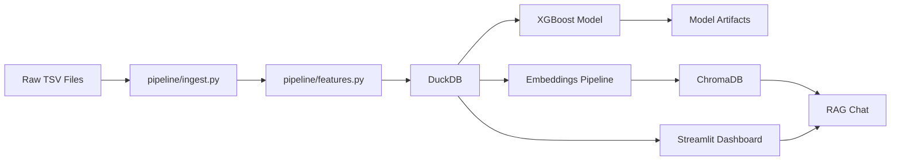

# 🏥 ReadmitIQ — Hospital Readmission Analytics Platform

An end-to-end AI-powered analytics platform for analyzing 30-day hospital readmission patterns in Medicare claims data. Built with a full data pipeline, machine learning prediction model, interactive dashboard, and a RAG-based natural language chat interface.

---

## 📌 Project Overview

Hospital readmissions within 30 days of discharge cost the US healthcare system billions annually. The CMS Hospital Readmissions Reduction Program (HRRP) penalizes hospitals with excess readmission rates — making readmission prediction and analysis a critical operational priority for hospital administrators and data teams.

ReadmitIQ transforms raw Medicare claims data into actionable intelligence through:
- Automated data pipeline with clinical feature engineering
- Machine learning model to identify high-risk admissions
- Interactive dashboard for exploratory analysis
- AI chat assistant for natural language querying of analytics

---

## 🗂️ Dataset

**Source:** [CMS Synthetic Medicare Enrollment, Fee-for-Service Claims and Prescription Drug Event Data (2025)](https://data.cms.gov/collection/synthetic-medicare-enrollment-fee-for-service-claims-and-prescription-drug-event)

**Files used:**
- `inpatient_claims.csv` — 58,066 raw inpatient claim rows (20,867 unique claims after deduplication)
- `beneficiary_2025.csv` — 10,000 Medicare beneficiary demographic records

**Note:** This is synthetic but realistic data generated by CMS using the Synthea simulation framework. It mirrors real Medicare claims structure but contains no real patient information.

---

## 🏗️ Architecture


---

## 🔬 Key Technical Decisions

**Why DuckDB over PostgreSQL?**
DuckDB is an in-process analytical database — no server setup, single file storage, and extremely fast for columnar analytical queries. Identical SQL syntax to PostgreSQL. Ideal for local analytical projects.

**Why deduplicate on CLM_ID?**
Raw inpatient claims contain multiple billing lines per claim (one per revenue center). Naive row counting inflates apparent readmission rates to ~57%. Deduplicating to one row per unique claim ID brings the rate to a realistic range.

**Why calculate LOS from dates instead of CLM_UTLZTN_DAY_CNT?**
The `CLM_UTLZTN_DAY_CNT` column in CMS synthetic data is largely unpopulated (73% zeros). Length of stay is computed directly from admission and discharge date columns instead.

**Why XGBoost over Logistic Regression?**
Baseline logistic regression achieved AUC 0.772. XGBoost achieved 0.908 — a 13.6 point improvement. The complexity is justified by the performance gain. `scale_pos_weight` handles the 70/30 class imbalance.

**Why pre-compute analytics for RAG instead of live SQL generation?**
LLMs are unreliable at generating accurate SQL over unfamiliar schemas. Pre-computing statistical summaries as readable text documents and embedding them in ChromaDB gives the LLM grounded, accurate context to reason over — eliminating hallucination on numerical queries.

---

## 📊 Model Performance

| Metric | Logistic Regression (Baseline) | XGBoost |
|--------|-------------------------------|---------|
| AUC-ROC | 0.772 | **0.908** |
| Avg Precision | 0.507 | **0.809** |
| CV Mean AUC | — | **0.907 ± 0.004** |
| Accuracy | — | 83% |
| Recall (Readmitted) | — | 86% |

**Top predictive features:** Medicare payment amount, total charges, length of stay, age group, admission type, diagnosis category.

---

## 🔍 Key Findings

- **Overall 30-day readmission rate:** 29.2% (synthetic data skews higher than real-world ~15-20% due to Synthea's complex chronic patient simulation)
- **85+ patients** have a 57.9% readmission rate — nearly double the overall average
- **Mental Health** (57.6%) and **Genitourinary** (59.3%) diagnoses show the highest readmission rates
- **Male patients** readmit at 34.7% vs 22.4% for female patients — a 12.3 point gap
- **Readmitted patients** have lower average charges ($2,736) than non-readmitted ($8,416) — suggesting shorter, more acute initial stays drive return visits
- **Emergency admissions** have significantly higher readmission rates than elective admissions

---

## 🚀 Getting Started

### Prerequisites
- Python 3.11+
- Anthropic API key (for chat assistant)

### Installation

```bash
git clone https://github.com/yourusername/ReadmitIQ.git
cd ReadmitIQ

python -m venv venv
venv\Scripts\activate  # Windows
# or
source venv/bin/activate  # Mac/Linux

pip install -r requirements.txt
```

### Setup

1. Download CMS Synthetic Medicare data from the link above
2. Place `inpatient_claims.csv` and `beneficiary_2025.csv` in `data/raw/`
3. Create `.env` file:

### Run the Pipeline

```bash
# Step 1 — Ingest and clean data
python pipeline/ingest.py

# Step 2 — Engineer features
python pipeline/features.py

# Step 3 — Train ML model
python pipeline/model.py

# Step 4 — Build chat embeddings
python chat/embeddings.py

# Step 5 — Launch dashboard
streamlit run dashboard/app.py
```

---

## 🗺️ Roadmap / Planned Extensions

- **Carrier claims integration** — analyze pre-admission outpatient visit patterns and post-discharge follow-up rates as predictors of readmission risk (450MB carrier claims file)
- **MIMIC-IV integration** — replace synthetic data with real de-identified EHR data from Beth Israel Deaconess Medical Center (access pending PhysioNet credentialing)
- **Multi-year trend analysis** — incorporate 2023 and 2024 CMS data files to show readmission rate trends over time
- **Patient risk scoring UI** — input patient characteristics and get real-time readmission risk score from the XGBoost model
- **Hospital benchmarking** — compare individual hospital performance against state and national averages

---

## 🛠️ Tech Stack

| Layer | Technology |
|-------|-----------|
| Data pipeline | Python, Pandas |
| Analytical database | DuckDB |
| ML model | XGBoost, Scikit-learn |
| Vector store | ChromaDB |
| LLM | Claude (Anthropic) |
| LLM framework | LangChain |
| Dashboard | Streamlit |
| Visualization | Plotly |
| Environment | Python venv |

---

## ⚠️ Disclaimer

This project uses synthetic Medicare data generated by CMS. It does not contain real patient information and should not be used to make clinical or operational decisions without validation against real institutional data.
